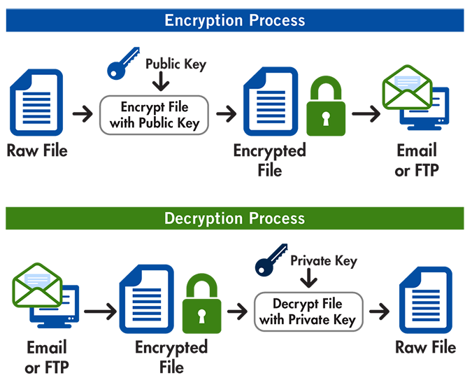
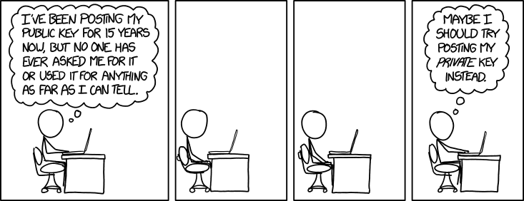

# SweetPGP

Because sometimes it can be hard to manage pgp alone

## Getting Started

This library is just a simple wrapper for [openpgpjs](https://github.com/openpgpjs/openpgpjs) :smile:


**You should know how PGP works in theory at least...**



_Credits to [FreecodeCamp for this image](https://cdn-media-1.freecodecamp.org/images/1*LpV5okf8ByND-ClSQZ7-aA.png)_


### Prerequisites

What things you need to install the software and how to install them

- [Node](https://nodejs.org/en/download/)


### Installing

Install the dependency

```
npm install --save sweetpgp
```

Use it in your project

```
const sweetPgp = require("sweetpgp");

// ... Your code...
```

### Run this project in your machine

These instructions will get you a copy of the project up and running on your local machine for development and testing purposes. See deployment for notes on how to deploy the project on a live system.

**Clone this project**

```
git clone https://github.com/ulisesGascon/sweetpgp.git
```

**Install dependencies**

```
npm install
```

**Run the test**

```
npm run test
```


## Built With

* [Openpgpjs](https://github.com/openpgpjs/openpgpjs) - The pgp module used

_Development only_
* [Standard](https://www.npmjs.com/package/standard) - Linting propuses
* [Husky](https://www.npmjs.com/package/husky) - Git Hooks
* [Nodemon](https://www.npmjs.com/package/nodemon) - Reload the process

## Contributing

Please read [CONTRIBUTING.md](CONTRIBUTING.md) for details on our code of conduct, and the process for submitting pull requests to us.

## Versioning

We use [SemVer](http://semver.org/) for versioning. For the versions available, see the [tags on this repository](https://github.com/ulisesGascon/sweetpgp/tags). 

## Authors

* **Ulises Gascón** - *Initial work* - [@ulisesGascon](https://github.com/ulisesGascon)

See also the list of [contributors](https://github.com/ulisesGascon/sweetpgp/contributors) who participated in this project.

## License

This project is licensed under the GNU GPL3.0 License - see the [LICENSE.md](LICENSE.md) file for details

## Acknowledgments

* This project is under development
* If you need a critical library to manage your PGP dependencies, please review tthis repo.
* This library is just a simple wrapper for [openpgpjs](https://github.com/openpgpjs/openpgpjs)


**Just for fun :trollface:**



_Credits to awesome [explainxkcd](https://www.explainxkcd.com/wiki/images/3/3b/public_key.png)_